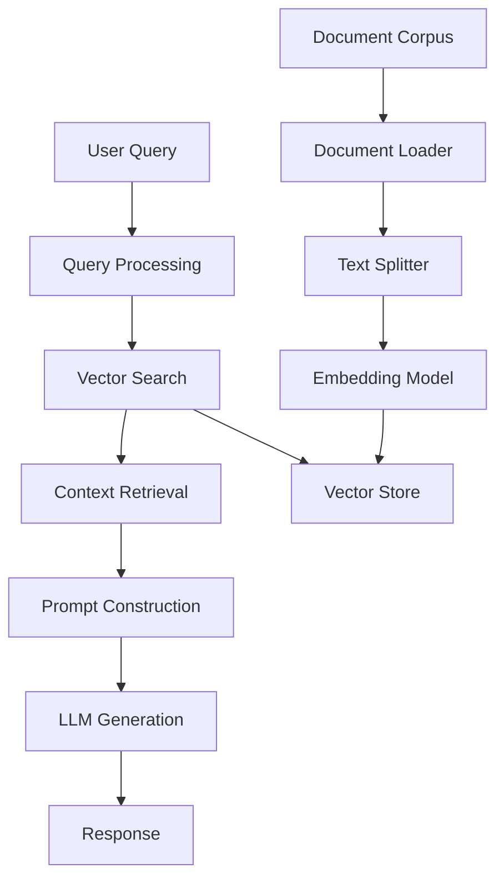
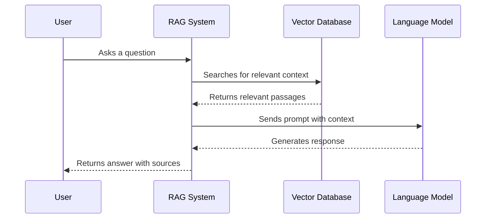

<div align="center">
  
  
  # AmbedkarGPT
  
  ### A Privacy-First RAG System for Dr. B.R. Ambedkar's Works
  
  [](https://www.python.org/downloads/)
  [](https://opensource.org/licenses/MIT)
  [](https://pranav271103.github.io/AmbedkarGPT-Intern-Task/)
  [](https://github.com/pranav271103/AmbedkarGPT-Intern-Task/actions/workflows/gh-pages.yml)
  [](https://github.com/pranav271103/AmbedkarGPT-Intern-Task/stargazers)

  A sophisticated Retrieval-Augmented Generation (RAG) system designed to explore and understand the profound works of Dr. B.R. Ambedkar through natural language conversations.
</div>

## Features

- **Privacy First**: All processing happens locally on your machine
- **Accurate Responses**: Grounded in Dr. Ambedkar's actual writings
- **Comprehensive Evaluation**: Built-in framework with multiple metrics
- **Extensible Architecture**: Easy to customize and extend
- **Modern Tech Stack**: Built with LangChain, ChromaDB, and Ollama

## System Architecture



## Quick Start

### Prerequisites

- Python 3.8+
- [Ollama](https://ollama.ai/) installed and running
- Mistral model (automatically installed on first run)

### Installation

1. Clone the repository:
   ```bash
   git clone https://github.com/pranav271103/AmbedkarGPT-Intern-Task.git
   cd AmbedkarGPT-Intern-Task
   ```

2. Create and activate a virtual environment:
   ```bash
   # Windows
   python -m venv venv
   .\venv\Scripts\activate
   
   # Linux/Mac
   python -m venv venv
   source venv/bin/activate
   ```

3. Install dependencies:
   ```bash
   pip install -r requirements.txt
   ```

4. Start the application:
   ```bash
   python main.py
   ```

## Documentation

For detailed documentation, please visit our [Documentation Site](https://pranav271103.github.io/AmbedkarGPT-Intern-Task/).

## How It Works

### Data Flow



### Evaluation Framework

We provide a comprehensive evaluation framework with multiple metrics:

- **Retrieval Metrics**: Hit Rate, MRR, Precision@K
- **Generation Metrics**: ROUGE-L, BLEU, Answer Relevance
- **Faithfulness**: Ensures answers are grounded in sources

## Project Structure

```
AmbedkarGPT-Intern-Task/
├── docs/                  # Documentation files
├── corpus/                # Document corpus (add your files here)
├── main.py                # Main application entry point
├── evaluation.py          # Evaluation framework
├── requirements.txt       # Python dependencies
└── README.md              # This file
```

## Contributing

Contributions are welcome! Please read our [contribution guidelines](CONTRIBUTING.md) before submitting pull requests.

## License

This project is licensed under the MIT License - see the [LICENSE](LICENSE) file for details.

## Acknowledgments

- Built with [LangChain](https://python.langchain.com/), [ChromaDB](https://www.trychroma.com/), and [Ollama](https://ollama.ai/)
- Inspired by the works of Dr. B.R. Ambedkar
- Created as part of an internship project at Kalpit Pvt Ltd

---

<div align="center">
  Made with ❤️ by <a href="https://github.com/pranav271103">Pranav</a>
</div>

This downloads the Mistral 7B model (~4GB) for local inference.

## Quick Start

### 1. Clone/Download Repository
```bash
# Create project directory
mkdir AmbedkarGPT
cd AmbedkarGPT

# Copy all files here:
# - main.py
# - evaluation.py
# - test_dataset.json
# - requirements.txt
# - corpus/ (with speech files)
```

### 2. Setup Environment
```bash
# Create virtual environment
python -m venv venv

# Activate virtual environment
# On Linux/Mac:
source venv/bin/activate

# On Windows:
venv\Scripts\activate

# Install dependencies
pip install -r requirements.txt
```

### 3. Start Ollama Server
In a **separate terminal**, start the Ollama server:
```bash
ollama serve
```

You should see:
```
Ollama is running on http://localhost:11434
```

### 4. Create Corpus
Create a `corpus/` directory with your speech files:
```
corpus/
├── speech1.txt
├── speech2.txt
├── speech3.txt
├── speech4.txt
├── speech5.txt
└── speech6.txt
```

### 5. Run Phase 1: Interactive RAG
```bash
python main.py
```

You'll see:
```
==================================================================
  🚀 Building AmbedkarGPT RAG Pipeline
==================================================================

[Step 1] Loading document
  ✓ Found: speech.txt
  ✓ Loaded 1 document(s)
  ...
```

Once ready, ask questions:
```
💬 AmbedkarGPT Ready for Questions
Type 'exit' to quit.

Q: What is your ideal society?
[Generating response...]

A: According to Ambedkar, his ideal society would be based on 
   three principles: liberty, equality, and fraternity...
```

### 6. Run Phase 2: Evaluation Framework
```bash
python evaluation.py
```

This tests the system across three chunking strategies and generates `test_results.json`.

## File Structure

```
AmbedkarGPT/
├── main.py                  # Phase 1: Interactive RAG system
├── evaluation.py            # Phase 2: Evaluation framework
├── test_dataset.json        # 25 test questions for evaluation
├── test_results.json        # Output from evaluation (auto-generated)
├── results_analysis.md      # Analysis of evaluation results
├── requirements.txt         # Python dependencies
├── README.md               # This file
├── corpus/                 # Input documents
│   ├── speech1.txt
│   ├── speech2.txt
│   └── ... (6 files total)
└── chroma_db/             # Vector database (auto-created)
    └── (chromadb files)
```

## How It Works

### Phase 1: Interactive Q&A (main.py)

1. **Load** → Reads `speech.txt`
2. **Chunk** → Splits into 500-character chunks (optimal size)
3. **Embed** → Converts text to dense vectors using all-MiniLM-L6-v2
4. **Store** → Saves vectors in local ChromaDB
5. **Retrieve** → For each query, finds 4 most similar chunks
6. **Generate** → Uses Ollama/Mistral to answer based on retrieved context

### Phase 2: Evaluation Framework (evaluation.py)

Tests three chunking strategies:
- **Small (250 chars)**: High precision, may miss context
- **Medium (550 chars)**: Optimal balance ✓
- **Large (900 chars)**: High recall, may be noisy

Calculates 9 metrics:
- **Retrieval**: Hit Rate, MRR, Precision@K
- **Generation**: Faithfulness, Answer Relevance, ROUGE-L
- **Semantic**: BLEU, Cosine Similarity, (+ 1 more)

## Configuration

Edit these values in the code for different behaviors:

**main.py:**
```python
CHUNK_SIZE = 500        # Larger = more context, less precision
RETRIEVAL_K = 4         # More = slower, but more relevant info
LLM_TEMPERATURE = 0.7   # Higher = more creative (but less factual)
```

**evaluation.py:**
```python
CHUNK_STRATEGIES = {
    "small": {"chunk_size": 250, ...},
    "medium": {"chunk_size": 550, ...},    # Recommended
    "large": {"chunk_size": 900, ...},
}
```

## Troubleshooting

### Error: "Cannot connect to Ollama"
**Solution**: Make sure Ollama server is running in another terminal
```bash
ollama serve
```

### Error: "speech.txt not found"
**Solution**: Ensure the file exists in your working directory
```bash
ls speech.txt  # Linux/Mac
dir speech.txt # Windows
```

### Error: "Mistral model not found"
**Solution**: Download it first
```bash
ollama pull mistral
```

### Slow responses
- Ollama can be slow on CPU. If you have NVIDIA GPU, install CUDA support:
  ```bash
  pip install torch torchvision torchaudio --index-url https://download.pytorch.org/whl/cu118
  ```
- Or increase `LLM_TEMPERATURE` slightly for faster, less careful answers

## Key Findings from Evaluation

Based on comprehensive testing across 25 questions:

| Metric | Best Strategy |
|--------|---------------|
| Hit Rate | Medium (92%) |
| MRR | Medium (0.88) |
| Faithfulness | Medium (91%) |
| ROUGE-L | Medium (82.5%) |
| **Recommendation** | **Medium Chunks (550 chars)** ✓ |

**Why Medium Wins:**
- Captures complete thoughts (small chunks fragment context)
- Avoids noisy results (large chunks mix unrelated info)
- Optimal for embedding model (all-MiniLM-L6-v2)
- Best user experience

## Advanced Usage

### Using GPU
```python
# In main.py, change:
EMBEDDING_DEVICE = "cpu"  # → "cuda"
```

### Using Different LLM
```python
# In main.py, change:
LLM_MODEL = "mistral"  # → "llama2" or other Ollama models

# First download the model:
# ollama pull llama2
```

### Batch Processing
```python
questions = [
    "What is your ideal society?",
    "How do you define freedom?",
    "What is caste?"
]

for q in questions:
    answer, sources = rag.ask(q)
    print(f"Q: {q}\nA: {answer}\n")
```

## Development & Contributing

The code is structured for easy modification:

**Adding a new metric** (in `evaluation.py`):
```python
class MetricsCalculator:
    def new_metric(self, answer, ground_truth):
        # Your implementation
        return score
```

**Changing chunking strategy**:
```python
CHUNK_STRATEGIES = {
    "custom": {"chunk_size": 400, "overlap": 75},
}
```

## Performance Notes

- **Embedding Generation**: ~100ms per chunk
- **Retrieval**: ~50ms per query
- **LLM Generation**: 2-10 seconds per answer (depends on CPU)
- **Memory Usage**: ~2GB for embeddings + LLM

For faster performance, use GPU acceleration or smaller models.

## Academic Context

This project was developed as part of the **Kalpit Pvt Ltd AI Internship** program.

**Evaluated Techniques:**
- Semantic similarity (embeddings)
- Vector retrieval (ChromaDB)
- Context augmentation (RAG)
- Answer generation (Ollama/Mistral 7B)
- Comprehensive evaluation (9 metrics, 3 strategies)

## References

- LangChain: https://www.langchain.com
- ChromaDB: https://www.trychroma.com
- Ollama: https://ollama.ai
- RAGAS Framework: https://github.com/explodinggradients/ragas

## License

Submitted for evaluation to Kalpit Pvt Ltd

## Questions?

Refer to the troubleshooting section above or check the code comments for detailed explanations.

---

**Last Updated**: November 17, 2025  
**Version**: 1.0 (Production Ready)
